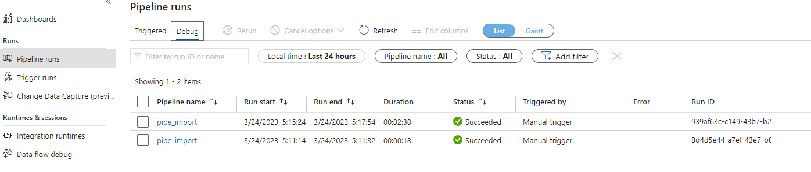
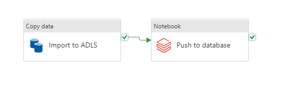
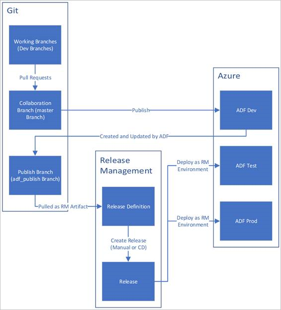
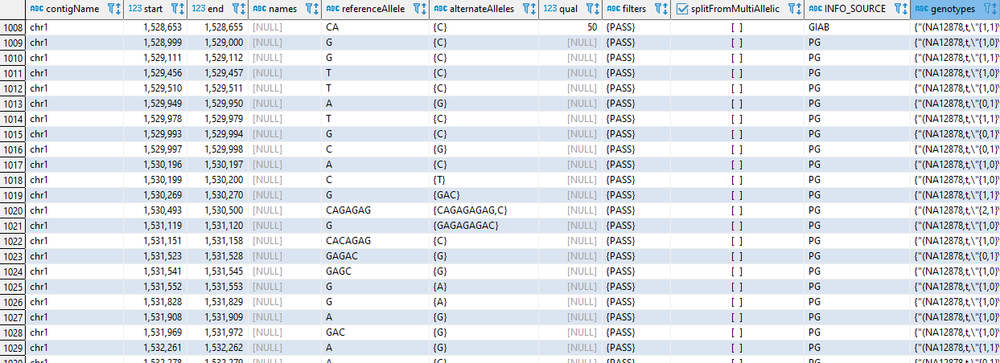

# Genomics ETL

This is a demo data engineering project built on Azure cloud. ETL pipeline implemented in Azure Data Factory is
ingesting and transforming  [Illumina Platinum Genomes dataset](https://learn.microsoft.com/en-us/azure/open-datasets/dataset-illumina-platinum-genomes?tabs=azure-storage).
Terraform is used for provisioning infrastructure.
Deployment pipelines are implemented in GitHub actions in accordance with
[official Microsoft guidelines](https://learn.microsoft.com/en-us/azure/data-factory/continuous-integration-delivery), 
with working CICD process between DEV and PROD environments. DEV ADF is connected to git repository, and ARM templates
are propagated to PROD environment through GitHub action.

### System components are:

- Azure Data Factory
- ADLS
- Azure Database for PostgreSQL Single Server
- Databricks
- KeyVault

### Environment variables

- ADMIN_USER_MAIL
- AZURE_CREDENTIALS
- CURRENT_AAD_USER_ID
- ILLUMINA_SAS_TOKEN
- ILLUMINA_SAS_URI
- SERVICE_PRINCIPAL_ID
- SERVICE_PRINCIPAL_OBJECT_ID
- SERVICE_PRINCIPAL_SECRET
- SUBSCRIPTION_ID
- TENANT_ID
- PAT

### Snapshots

Databricks visualization:

ADF view:

CICD:  

Postgres:

TODO:
* Automatic release process on *adf_publish* branch with its own release
* Manual release process with semantic versioning as parameter (major, minor & patch bump)
