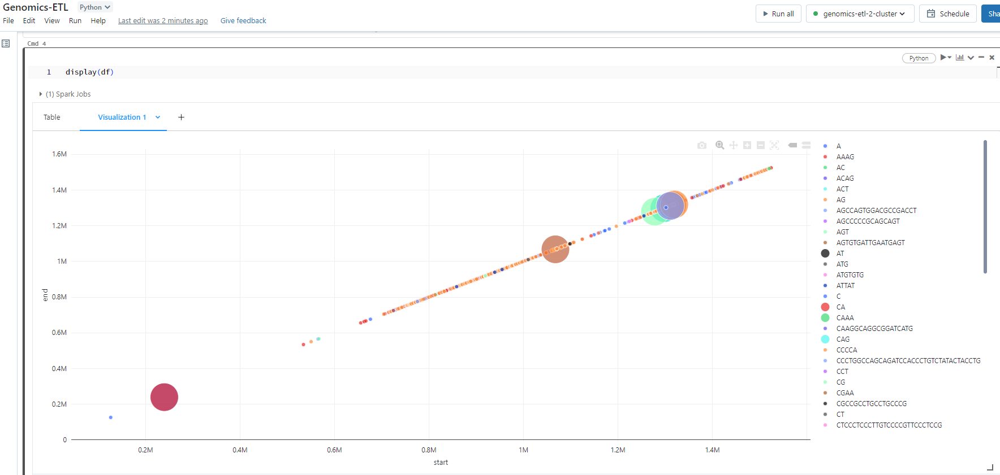

# Genomics ETL

This is a demo data engineering project built on Azure cloud. ETL pipeline implemented in Azure Data Factory is
ingesting and transforming  [Illumina Platinum Genomes dataset](https://learn.microsoft.com/en-us/azure/open-datasets/dataset-illumina-platinum-genomes?tabs=azure-storage).
Terraform is used for provisioning infrastructure.
Deployment pipelines are implemented in GitHub actions in accordance with
[official Microsoft guidelines](https://learn.microsoft.com/en-us/azure/data-factory/continuous-integration-delivery), 
with working CICD process between DEV and PROD environments.

System components are:

- Azure Data Factory
- ADLS
- KeyVault
- Postgres

Databricks visualization:

